# Requirements and Specification Document

## TeamName

**6 of Badgers**

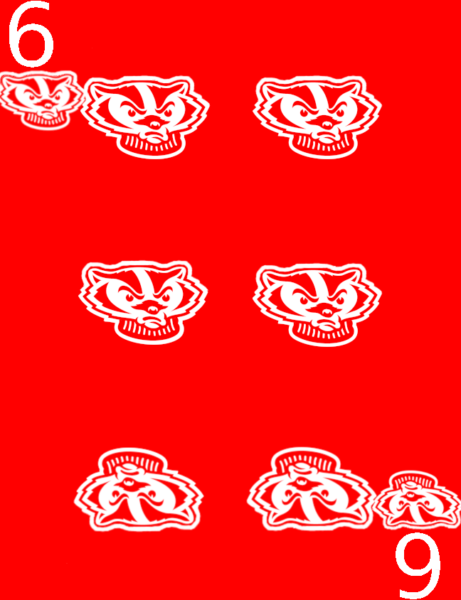

### Project Abstract

<!--A one paragraph summary of what the software will do.-->
This software will allow users to play Euchre synchronously with friends.

### Customer

<!--A brief description of the customer for this software, both in general (the population who might eventually use such a system) and specifically for this document (the customer(s) who informed this document). Every project will have a customer from the CS506 instructional staff. Requirements should not be derived simply from discussion among team members. Ideally your customer should not only talk to you about requirements but also be excited later in the semester to use the system.-->
The customer for this project is someone who wishes to play Euchre with their friends or by themselves against computer controlled opponents.

### User Requirements


<!--This section lists the behavior that the users see. This information needs to be presented in a logical, organized fashion. It is most helpful if this section is organized in outline form: a bullet list of major topics (e.g., one for each kind of user, or each major piece of system functionality) each with some number of subtopics.-->

1. When the user starts a game, cards will be randomly assigned to all players and a face up card will be assigned.  The player who's turn it is will have their hand displayed and the face up card will be visible to all players.
    * Test:  Backend: All cards are valid and there are no duplicates.  Frontend: Cards are visible and match the backends cards.  Cards must be able to be visually distinct to convey rank and suit.
2. The program shall display a NavBar that will provide access to all parts of the frontend.
    * Test: All pages of the frontend are reachable by clicking on the navbar options.
3. The program shall progress through players.  When it is a player's turn, there cards will become visible.  When the user selects a card, that card shall be removed from their hand and will be moved to the played cards area.  The next player will then be prompted to select a card or a round end screen will be presented.
    * Test: Backend: Played cards recieved from frontend should be removed from player's hand object and turn should increment.  Frontend: Played card must be moved out of player hand and to the played card area.
4. At any time during the game, trump, overall score, and usernames must be visible to all players.
    * Test: Backend: Score and trump must be calculated and updated at the end of each round.  The team that won should have a higher score than their previous round's score.  Frontend:  During a game, these veriables must be displayed and updated when necessary.
5.  The game must end when a team's score is above or equal to the point threshhold.  
    * Test:  Backend: When the point threshhold is met by either team, all game processes must terminate.  Frontend:  A victory/defeat/summary page must appear to inform users.
6.  A game must be able to be saved and viewed at a later state:
    * Test: Backend: A game is able to be saved and then retrieved with matching and complete information.  Frontend:  There must be an option to save games after they finish.  There must also be a page to view sorted and sort saved games that displays the relevant information including players, teams, which team won, and overall score.  
7.  The final product will be able to mirror a game of euchre.
    * Test:  After all four players play their cards in a round, the round must be socred correctly.  The winner of the trick must have their points increased.  The starting player, trick,and trump will be recalculated when needed.  The game will end when a team reahces the requirements to win.
8.  There simply must be an option to play music.
    * Test: Frontend: There must be an option to play or not play music avalaible to the user at all times during the game.  
9.  There shall be a help screen avaiable to the user via a NavBar at all times.
    * Test: Frontend: There must be a help button that redirects to a page describing the website and rules of euchre available at all times.

### Use Cases & User Stories

<!--Use cases and user stories that support the user requirements in the previous section. The use cases should be based off user stories. Every major scenario should be represented by a use case, and every use case should say something not already illustrated by the other use cases. Diagrams (such as sequence charts) are encouraged. Ask the customer what are the most important use cases to implement by the deadline. You can have a total ordering, or mark use cases with “must have,” “useful,” or “optional.” For each use case you may list one or more concrete acceptance tests (concrete scenarios that the customer will try to see if the use case is implemented).-->

* As a player, I want the cards to be randomized at the start of each game so that each game offers a unique and fair playing experience.
    * I should be able to see my four cards, and not be able to see any other cards
    * Test: There should be 4 cards in the players hand. Furthermore, there should be 20 other cards leftover with no duplicates.
* As a player, I want a navigation bar to easily access different sections of the app (e.g.game rul es) so that I can navigate through the app seamlessly.
    * I should have a navigation bar that functions
    * Test: I should see a navigation bar on all portions of the screen, and I should be able to use it.
* As a player, I want to see my own hand of cards displayed on the screen so that I can strategize and plan my moves effectively during the game.
    * Test: I should be able to see the cards
* As a player, I want the gameplay to be turn-based so that each player gets a fair chance to make their moves and decisions during the game.
    * Test: there should be a timer that runs based on the input of the user (which varies). This is by design.
* As a player, I want the game session to display relevant information such as the current score, the trump suit, and the players' names so that I can keep track of the game's progress.
    * Test: this should be visually displayed and updated with each play.

* As a player, I want the game session to end automatically when a team reaches the winning score so that the game concludes smoothly and the winning team is declared.
    * Test: this should work for multiple scores. This should also be automatic.

* As a player, my games should be saved for later
    * Test: On the frontend this should be displayed. For the backend, we should be able to create a game dummy, and pull the relavant information, having it work.
* As a player, I want to be able to see the game data that is saved
    * Test: I should be able to save an incomplete game.
* As a player, I want to have a page that displays and shows all my saved and played games
    * Test: Frontend should call for the games to be displayed. It shall be displayed from newest to oldest.
* As a user, I want to be able to use docker to play the game locally.
    * Test: calling one docker command will cause the game to start running seamlessly, with integration from the frontend, backend, and database.
* As a player, I want to have a page and interface that allows me to start a game
    * Test: the frontend shall display a screen that allows the user to play a game, get the rules, or get help.
* As a player, I should have the basic functionality logic to play
    * Test: Overall function of the game works and runs correclty.
* As a user I want to be able to choose to play against the computer or against other players
    * Test: Frontend; there is an option for the number of players.
    * Test: Backend: There will be 4 game options. For each, a game runs correctly based on the number of human players inputted.

* As a player, I want a home page that can introduce me to the site and let me navigate to other parts of the site
    * Test: the frontend will display a homepage.
* As a player, I should be able to play the game with up to 4 people on one device
    * Test: Frontend; there is an option for the number of players.
    * Test: Backend: There will be 4 game options. For each, a game runs correctly based on the number of human players inputted.
* As a player, I want an about page for each game that explains the rules of the games and gives me information I may not know
    * Test: There will be a displayed written rules under the Help Tab.
* As a player, I want to see other players' cards (the back not front) around me
    * Test: there will be red graphics on the gameplay page.

* As a player, I want to ensure that that my games are shown by date played, and then sorted by date.
    *  Test: Frontend: Verify that the games are displayed in the order of date played on the user interface.
    * Test: Backend: Confirm that the games are sorted correctly by date played in the backend database.
* As a player, I want the design of the cards game visuals to be clear and easy to understand
    *  Test: the cards will display color, suit, and number.


### User Interface Requirements

<!--Describes any customer user interface requirements including graphical user interface requirements as well as data exchange format requirements. This also should include necessary reporting and other forms of human readable input and output. This should focus on how the feature or product and user interact to create the desired workflow. Describing your intended interface as “easy” or “intuitive” will get you nowhere unless it is accompanied by details.-->

<!--NOTE: Please include illustrations or screenshots of what your user interface would look like -- even if they’re rough -- and interleave it with your description.-->

<!--Images can be included with ``-->
## Actual Game Images
GAMEPLAY
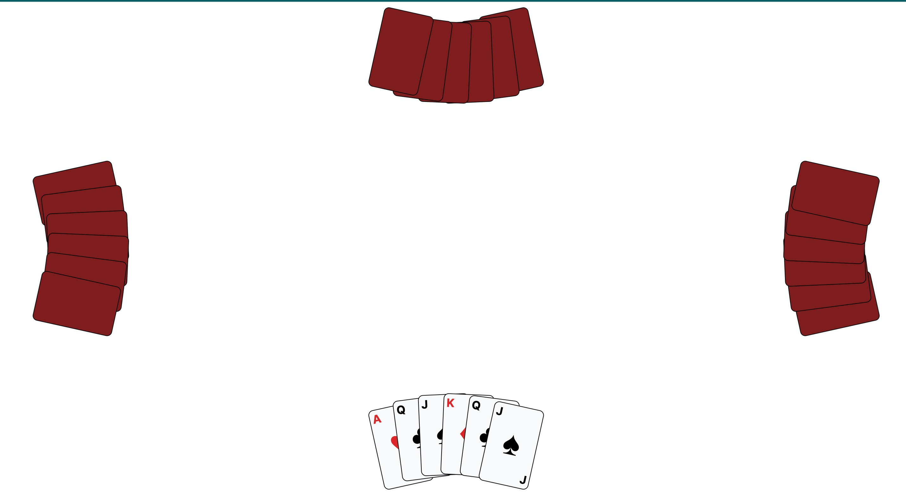

GAME SETUP
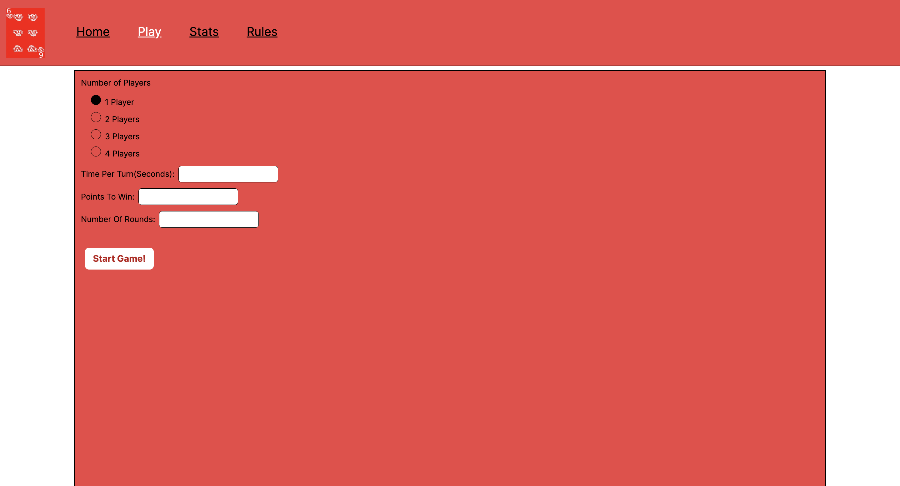

STATS
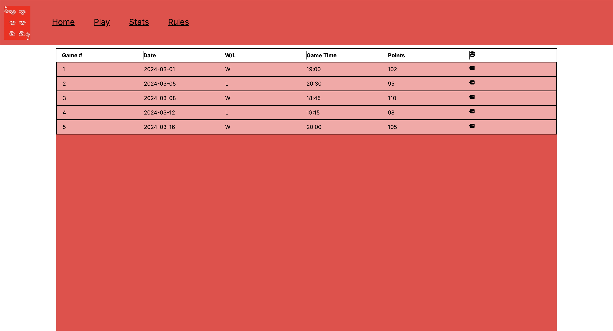

RULES
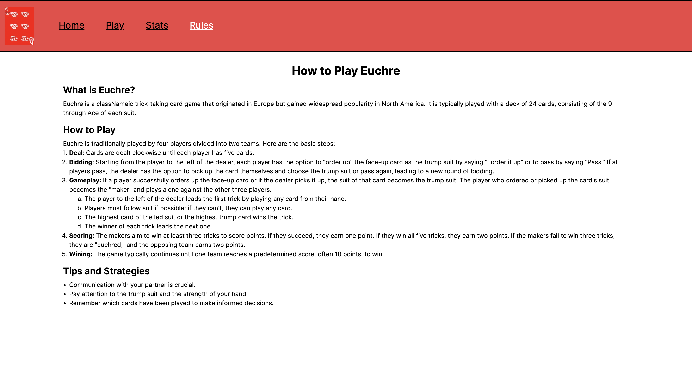

### Security Requirements

<!--Discuss what security requirements are necessary and why. Are there privacy or confidentiality issues? Is your system vulnerable to denial-of-service attacks?-->

Our system will be hosted and played locally. There are no privacy or confidentiality issues. THe only identifying data would be the name of the players.

### System Requirements

<!--List here all of the external entities, other than users, on which your system will depend. For example, if your system inter-operates with sendmail, or if you will depend on Apache for the web server, or if you must target both Unix and Windows, list those requirements here. List also memory requirements, performance/speed requirements, data capacity requirements, if applicable.-->

1. React will be used for frontend; React needs to be able to run on the computer
2. Java will run the backend
3. MySQL will hold the database.
4. Docker is needed to run the image

#### System Architecture Diagram

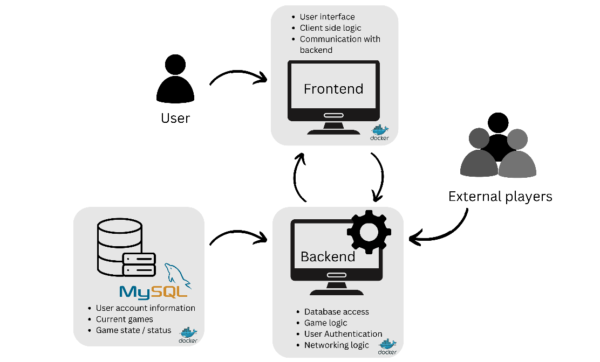


### Specification

<!--A detailed specification of the system. UML, or other diagrams, such as finite automata, or other appropriate specification formalisms, are encouraged over natural language.-->

<!--Include sections, for example, illustrating the database architecture (with, for example, an ERD).-->

<!--Included below are some sample diagrams, including some example tech stack diagrams.-->

<!--You can make headings at different levels by writing `# Heading` with the number of `#` corresponding to the heading level (e.g. `## h2`).-->

##### Navbar
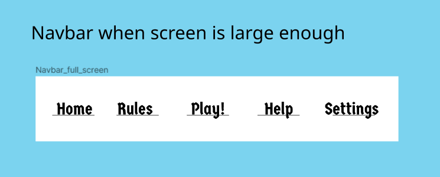

The navbar hold multiple buttons. Home will show the user the game creation screen. Rules will show the user what the rules for the game are. Help will give hints for euchre. Play will go to the game that is being played.  The navbar will also change based on screen size and game state.

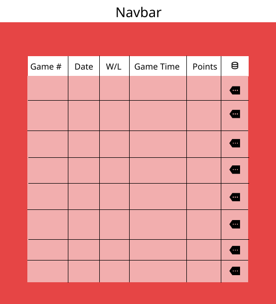

This is the saved games screen. It will show the previous game, sorted by most recent first. It will have a game number, the day played, whether you won or loss, the game time, and the number of points won during the game.

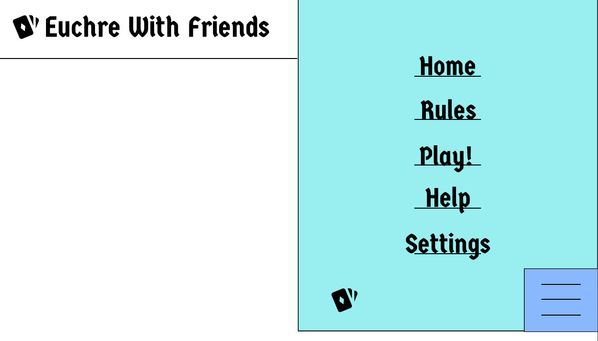

This is the homepage that would show up after clicking home on the navigation bar. It includes the main logo and a vertical version of the navigation bar.

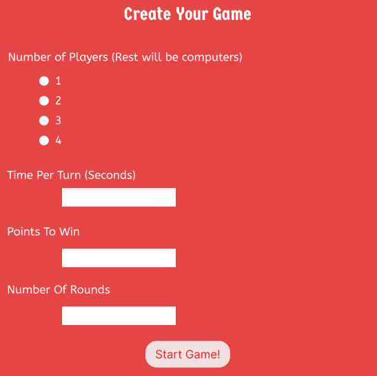

This is the game creation screen. It allows to pick the number of physical players playing.It also allows the user to set the number of seconds each turn will be allowed. It indicates the number of points needed to win, and the number of rounds played.

#### Technology Stack


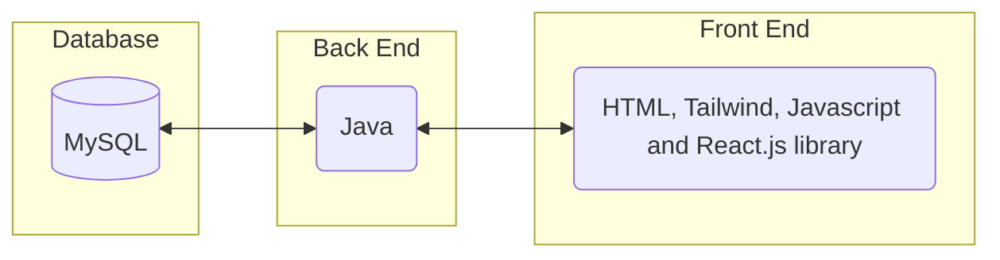

#### Database

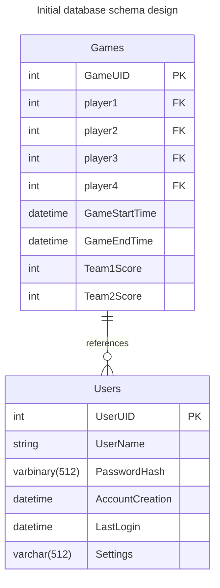


##### Card Representation
Enumeration for the suits and the type of card
Card and Enumeration TSX FIlesf for the frontend
React for the frontend.

#### Flowchart

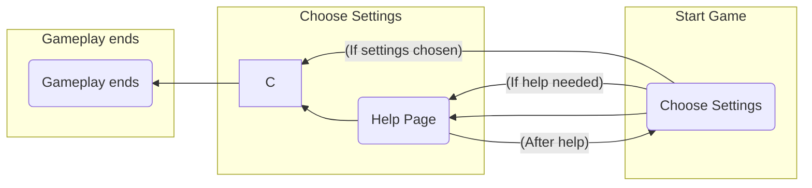

#### System Architecture Diagram


#### Docker and Setting it All Up
Please refer to 

# Coding Standards & Conventions


This document outlines the standards we will use for our code, but is subject to change. 

## 1. Commenting
For commenting, we will follow 3 basic rules
1. Method Headers have comments above describing what the method does. In addition, it should define what the parameters and return values are.
2. Complicated blocks of code should have a simple comment explaining what it does. No need to comment on something like a simple if-else statement, but for something such as regex, define what the regex does
3. Methods/Files should have author commenting. This helps us know who wrote what code, so we can easily ask for help when needed, and have an easy breakdown of project contribution

## 2. Indentation/Whitespaces
Please use tabs to indent your lines of code. It's not the end of the world if you use spaces, but it would be nice to have some consistency. 

When it comes to the indentation of brackets for code blocks and methods, please add the first bracket at the end of the line and the last bracket on a separate line. For if-else, try-catch, or any other similar statements, please don't add the second one right after the previous bracket. Follow the example as shown below.
```
if(true) {
    // something
}
else {
    // something else
}
```
When it comes to whitespaces, make it easy to read by adding whitespaces between operators and commas. When adding a comma, add a whitespace after the comma, and for operators, add white spaces before and after the operator. 

## 3. Naming Convention
When naming methods, please follow camel case rules. Classes should obviously not follow this convention as they will start with capital letters. 

Constants should be identified using full uppercase naming, such as MAX_NUM.

For variables, naming convention is more lenient, but the variable names should be able to be easily understood. Exceptions for this are in loops and exceptions in catch statements. Camel case is allowed, as is underscoring. Examples of allowed variable naming convention types are shown below
```
int start = 0 // allowed
boolean startGame = true // allowed
boolean start_game = true // allowed
boolean start_Game = true // allowed
for(int x = 0; x < 100; x++) {
    // allowed
}
int x = 0; 
while(x < 100) // allowed

int s = 0 // not allowed 
boolean startgame = true // not allowed
boolean Startgame = true // not allowed
```
Lastly, we would like to avoid shadowing. Avoid naming two variables in different scopes the name things. For instance variables of classes, prepend "my" to the variable name, such as "mySuit." This helps readability, and easily avoids shadowing.

## 4. Method Length/Breakdown
In general, methods should not be too long, as they will get confusing. If you find yourself having a long method where various parts of the method are used for different things, please create helper methods to use for readability. Furthermore, if you find multiple repeating processes, it is imperative these repeating processes are turned into helper methods. 

## 5. Error Return Values and Handling
For functions that can encounter errors, return a "0" for program exiting successfully, and a "1" for program exiting with errors. When Handling multiple exceptions, start with the most specific/likely first, and go down the ladder until hitting parent Exception class. Example shown below

```

try {
    // something
}
catch(IllegalArgumentException e) {
    // something 
}
catch(IOException e) {
    // something
}
catch(Exception e) {
    // something 
}
```


