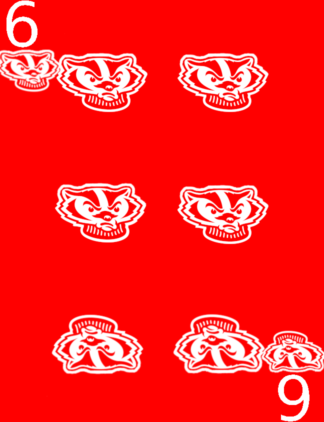
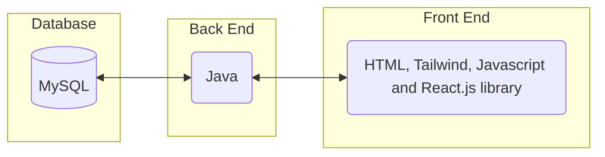

# Requirements and Specification Document

## TeamName

**6 of Badgers**



### Project Abstract

<!--A one paragraph summary of what the software will do.-->
This software will allow users to play Euchre synchronously with friends.

### Customer

<!--A brief description of the customer for this software, both in general (the population who might eventually use such a system) and specifically for this document (the customer(s) who informed this document). Every project will have a customer from the CS506 instructional staff. Requirements should not be derived simply from discussion among team members. Ideally your customer should not only talk to you about requirements but also be excited later in the semester to use the system.-->
The customer for this project is someone who wishes to play Euchre with their friends or by themselves against computer controlled opponents.

### User Requirements


<!--This section lists the behavior that the users see. This information needs to be presented in a logical, organized fashion. It is most helpful if this section is organized in outline form: a bullet list of major topics (e.g., one for each kind of user, or each major piece of system functionality) each with some number of subtopics.-->


### Use Cases & User Stories

<!--Use cases and user stories that support the user requirements in the previous section. The use cases should be based off user stories. Every major scenario should be represented by a use case, and every use case should say something not already illustrated by the other use cases. Diagrams (such as sequence charts) are encouraged. Ask the customer what are the most important use cases to implement by the deadline. You can have a total ordering, or mark use cases with “must have,” “useful,” or “optional.” For each use case you may list one or more concrete acceptance tests (concrete scenarios that the customer will try to see if the use case is implemented).-->

1. As a player, I want the cards to be randomized at the start of each game so that each game offers a unique and fair playing experience.
2. As a player, I want to be able to create and join game sessions with my friends so that we can play Euchre together regardless of our physical locations.
3. As a player, I want a navigation bar to easily access different sections of the app (e.g.game rul es) so that I can navigate through the app seamlessly.
4. As a player, I want to see my own hand of cards displayed on the screen so that I can strategize and plan my moves effectively during the game.
5. As a player, I want the gameplay to be turn-based so that each player gets a fair chance to make their moves and decisions during the game.
6. As a player, I want to be notified when it's my turn to play a card so that I can stay engaged and actively participate in the game.
7. As a player, I want the option to set a time limit for each turn so that the game progresses at a reasonable pace and doesn't get stalled by indecision.
8. As a player, I want the game session to display relevant information such as the current score, the trump suit, and the players' names so that I can keep track of the game's progress.
9. As a player, I want the option to chat with other players during the game session so that we can communicate and strategize together.
10. As a player, I want the game session to end automatically when a team reaches the winning score so that the game concludes smoothly and the winning team is declared.
### User Interface Requirements

<!--Describes any customer user interface requirements including graphical user interface requirements as well as data exchange format requirements. This also should include necessary reporting and other forms of human readable input and output. This should focus on how the feature or product and user interact to create the desired workflow. Describing your intended interface as “easy” or “intuitive” will get you nowhere unless it is accompanied by details.-->

<!--NOTE: Please include illustrations or screenshots of what your user interface would look like -- even if they’re rough -- and interleave it with your description.-->

<!--Images can be included with ``-->

### Security Requirements

<!--Discuss what security requirements are necessary and why. Are there privacy or confidentiality issues? Is your system vulnerable to denial-of-service attacks?-->

### System Requirements

<!--List here all of the external entities, other than users, on which your system will depend. For example, if your system inter-operates with sendmail, or if you will depend on Apache for the web server, or if you must target both Unix and Windows, list those requirements here. List also memory requirements, performance/speed requirements, data capacity requirements, if applicable.-->


### Specification

<!--A detailed specification of the system. UML, or other diagrams, such as finite automata, or other appropriate specification formalisms, are encouraged over natural language.-->

<!--Include sections, for example, illustrating the database architecture (with, for example, an ERD).-->

<!--Included below are some sample diagrams, including some example tech stack diagrams.-->

<!--You can make headings at different levels by writing `# Heading` with the number of `#` corresponding to the heading level (e.g. `## h2`).-->

#### Technology Stack

Here are some sample technology stacks that you can use for inspiration:



#### Database

```mermaid
To Be Designed
```

#### Class Diagram

```mermaid
To Be Designed
```

#### Flowchart

```mermaid
To Be Designed
```

#### Behavior

```mermaid
To Be Designed
```

#### Sequence Diagram

```mermaid
To Be Further Specified
```


### Standards & Conventions

<!--Here you can document your coding standards and conventions. This includes decisions about naming, style guides, etc.-->
# Coding Standards

This document outlines the standards we will use for our code, but is subject to change. 

## 1. Commenting
For commenting, we will follow 3 basic rules
1. Method Headers have comments above describing what the method does. In addition, it should define what the parameters and return values are.
2. Complicated blocks of code should have a simple comment explaining what it does. No need to comment on something like a simple if-else statement, but for something such as regex, define what the regex does
3. Methods/Files should have author commenting. This helps us know who wrote what code, so we can easily ask for help when needed, and have an easy breakdown of project contribution

## 2. Indentation/Whitespaces
Please use tabs to indent your lines of code. It's not the end of the world if you use spaces, but it would be nice to have some consistency. 

When it comes to the indentation of brackets for code blocks and methods, please add the first bracket at the end of the line and the last bracket on a separate line. For if-else, try-catch, or any other similar statements, please don't add the second one right after the previous bracket. Follow the example as shown below.
```
if(true) {
    // something
}
else {
    // something else
}
```
When it comes to whitespaces, make it easy to read by adding whitespaces between operators and commas. When adding a comma, add a whitespace after the comma, and for operators, add white spaces before and after the operator. 

## 3. Naming Convention
When naming methods, please follow camel case rules. Classes should obviously not follow this convention as they will start with capital letters. 

Constants should be identified using full uppercase naming, such as MAX_NUM.

For variables, naming convention is more lenient, but the variable names should be able to be easily understood. Exceptions for this are in loops and exceptions in catch statements. Camel case is allowed, as is underscoring. Examples of allowed variable naming convention types are shown below
```
int start = 0 // allowed
boolean startGame = true // allowed
boolean start_game = true // allowed
boolean start_Game = true // allowed
for(int x = 0; x < 100; x++) {
    // allowed
}
int x = 0; 
while(x < 100) // allowed

int s = 0 // not allowed 
boolean startgame = true // not allowed
boolean Startgame = true // not allowed
```
Lastly, we would like to avoid shadowing. Avoid naming two variables in different scopes the name things. For instance variables of classes, prepend "my" to the variable name, such as "mySuit." This helps readability, and easily avoids shadowing.

## 4. Method Length/Breakdown
In general, methods should not be too long, as they will get confusing. If you find yourself having a long method where various parts of the method are used for different things, please create helper methods to use for readability. Furthermore, if you find multiple repeating processes, it is imperative these repeating processes are turned into helper methods. 

## 5. Error Return Values and Handling
For functions that can encounter errors, return a "0" for program exiting successfully, and a "1" for program exiting with errors. When Handling multiple exceptions, start with the most specific/likely first, and go down the ladder until hitting parent Exception class. Example shown below
```
try {
    // something
}
catch(IllegalArgumentException e) {
    // something 
}
catch(IOException e) {
    // something
}
catch(Exception e) {
    // something 
}
```


